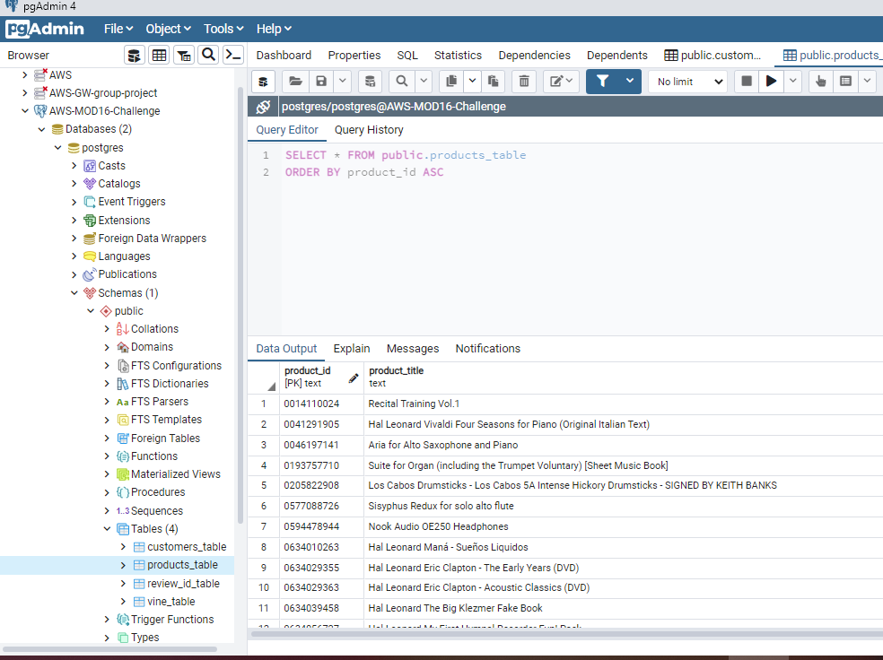
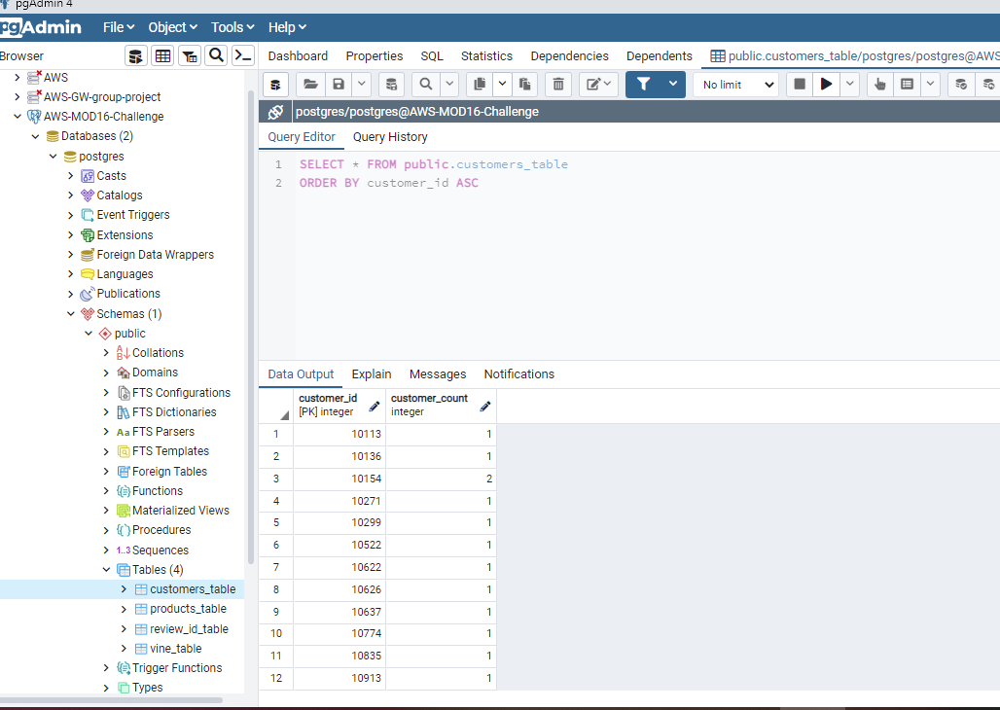
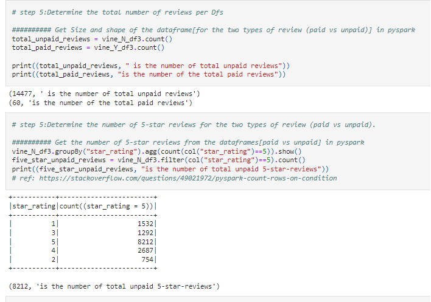
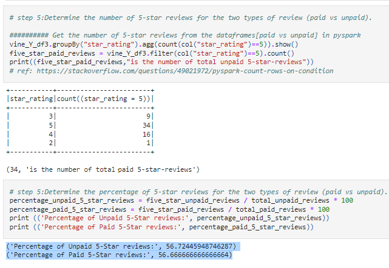

# Amazon_Vine_Analysis
Mod16

## **Overview of the analysis:** 

The purpose of this module has successfully made me to be familiarized with  a new dimension of pgAdmin. It is because pgAdmin is used to further clean or edit the data from Google Colab, which is a substitute of Jupyter Notebook, that does ETL after the data is being transfered from AWS (Amazon Web server storage S3 bucket). The following pictures shows some of the successfull exports and imports of the google colab created dataframes into the SQL-created tables. 

<figure>
  
  <figcaption>Picture 1: A successful-Load of the DataFrames into pgAdmin.</figcaption>
</figure>

<figure>
  
  <figcaption>Picture 2: A successful-Load of the DataFrames into pgAdmin.</figcaption>
</figure>

The purpose of the challenge is to analyse Amazon reviews written by members of the paid Amazon Vine program. In this analysis, the dataset on Musical Instrunents have been on scrutiny to be analysed.

## **Results:**

1. There are total of 14477 for the unpaid reviews and 60 of the paid one. 

2. 8212 is the number of total unpaid 5-star-reviews and 34 is the total number of paid ones.

<figure>
  
  <figcaption>Picture 3: Google Colab results (a).</figcaption>
</figure>

3. Percentage of Unpaid 5-Star reviews: 56.724% 
    & 
   Percentage of Paid 5-Star reviews: 56.667% 

<figure>
  
  <figcaption>Picture 3: Google Colab results (b).</figcaption>
</figure>

## **Summary:**
Since both paid and unpaid vine reviews are on the same percentages. I believe that the positive reviews are not bias. However, i can still form hypothesis.

In order for me to back my hypothesis, I would like to have the percentages of all other numberss stars-reviews. It is for me to get to the better and sound conclusion. 

